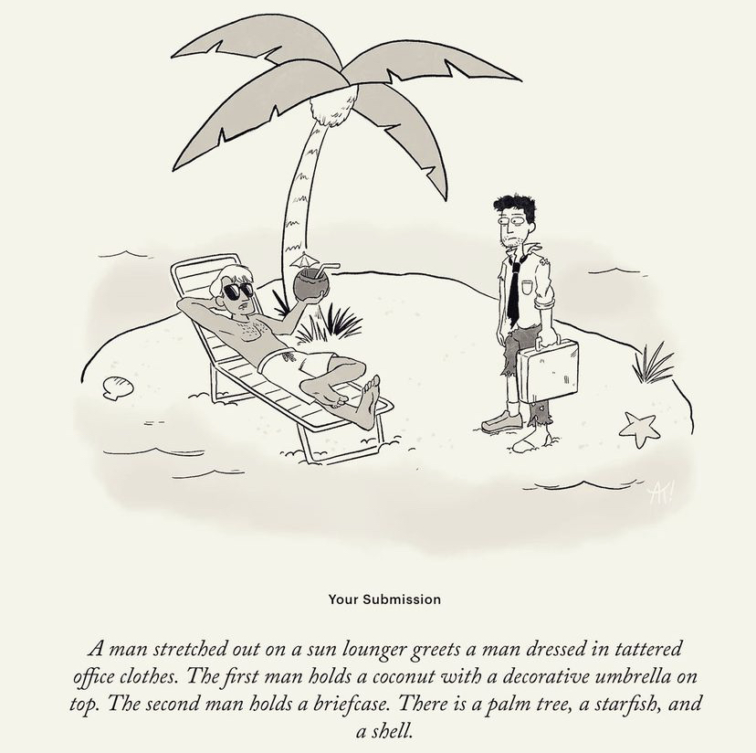
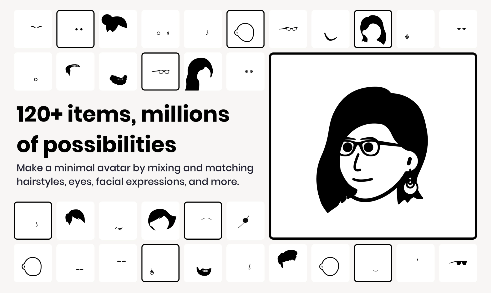
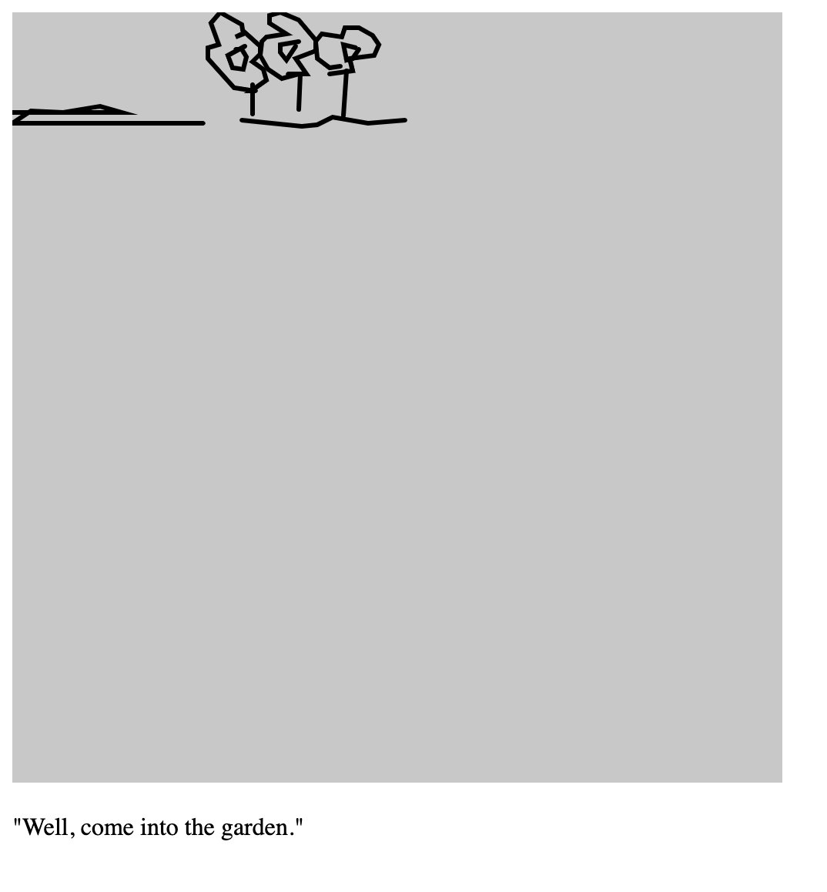
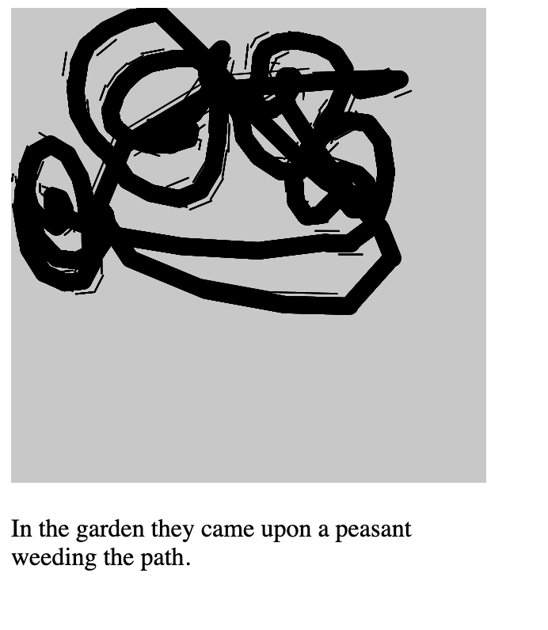
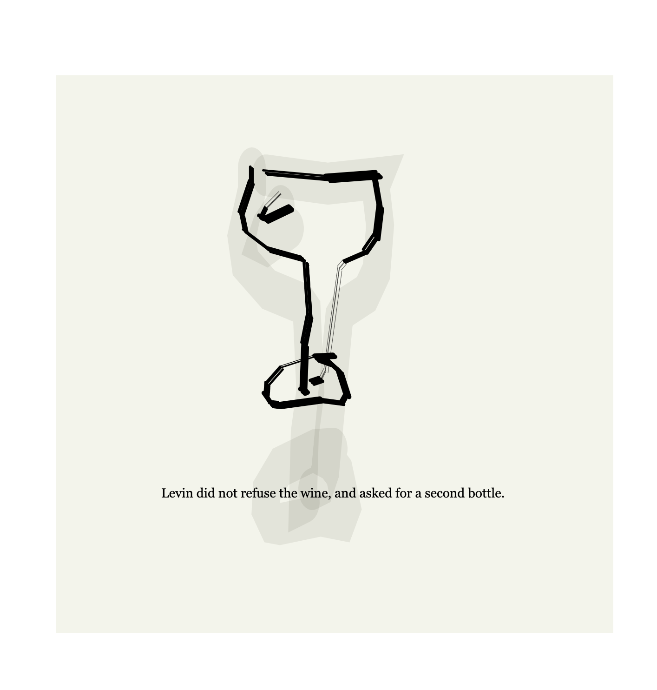
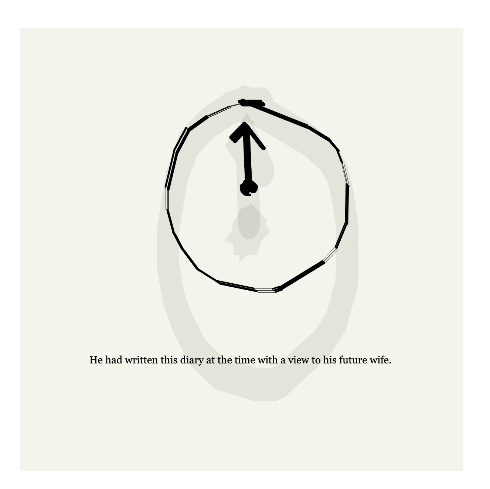
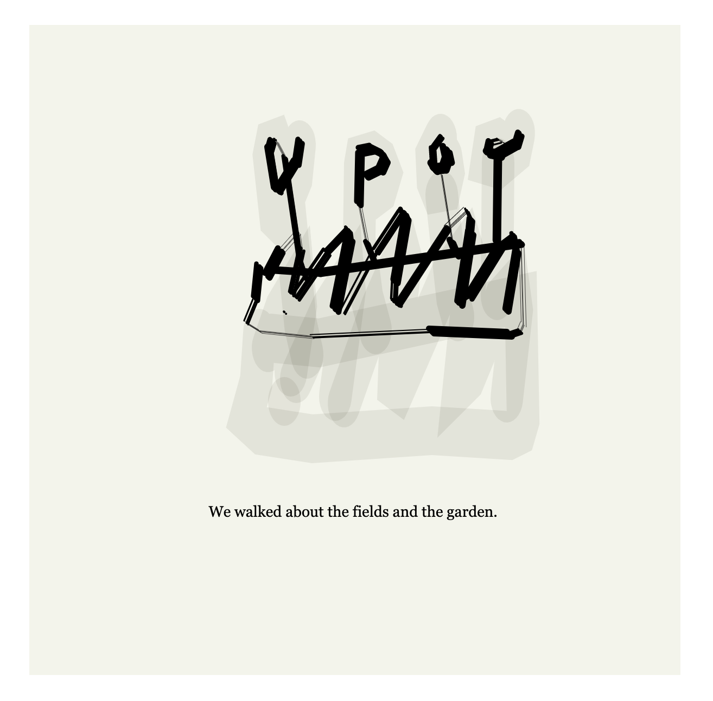
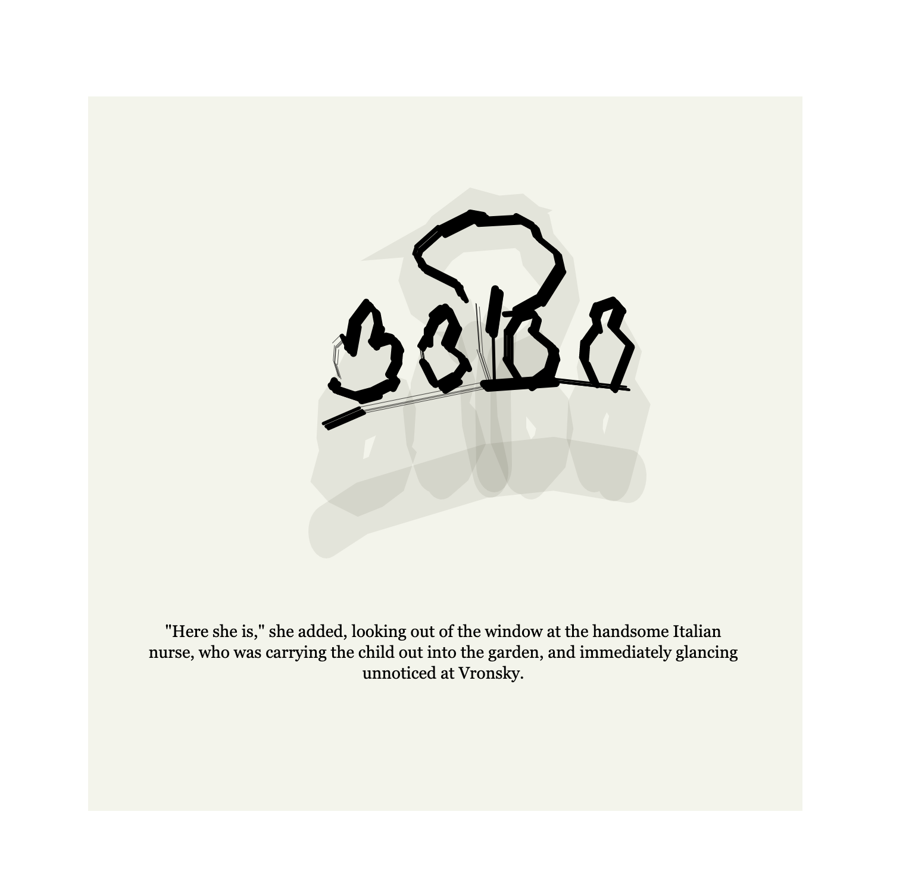
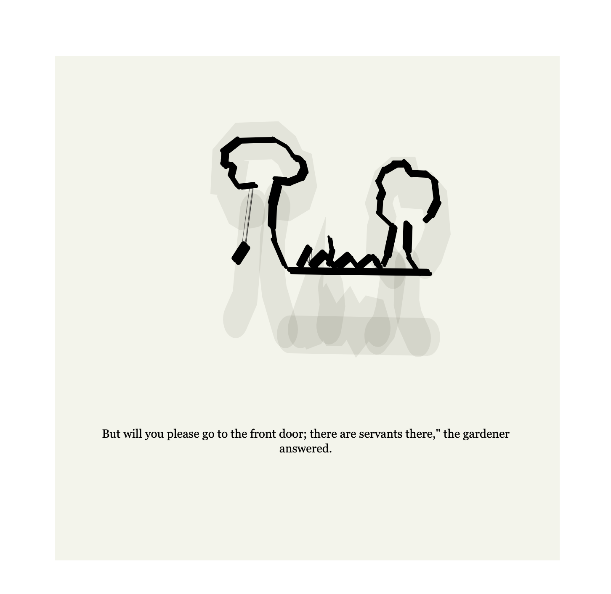
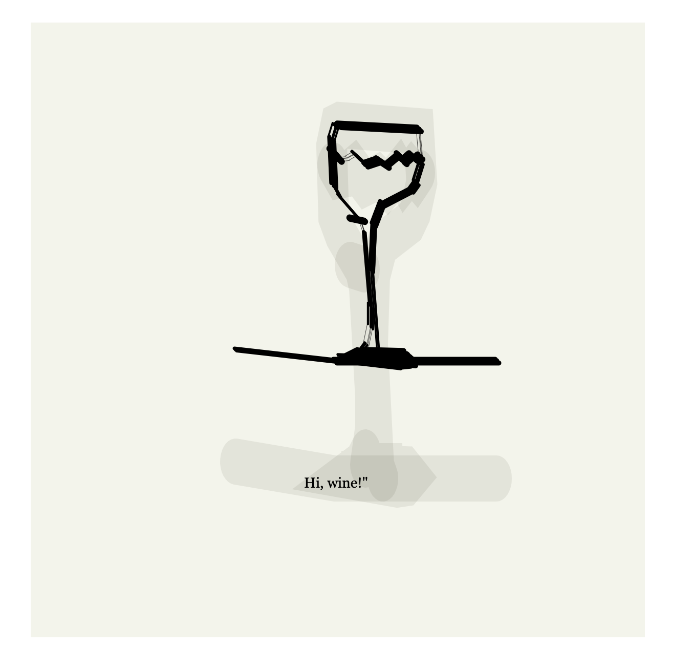

# A2Z_final

Research of illustrations systems

For my final project, I wanted to take what I learned from this class and combine it with my work outside of it.

I work as an illustrator, and I enjoyed exploring rita and the way it made me think about language. The way computer analyze text is by classification- nouns, verbs, etc. I was wondering how I can create computational illustrations that behave in the way rita constract sentences.

Illustration, however, is all about the subtext. right?

**Corporate Memphis**

Another point of interst for me is what is called "Corporate Memphis". In 2017 Facebook released an illustration system called "Allegria" that had is constracted from rules and parts, and the rest of the tech industry followed suit. The style work for cheap illustrations as well, since you can build it very easly by combining and merging differnt stock illustrations. According to wikipedia "The style has since been criticized for being generic,[5] overused, and attempting to sanitize public perception by presenting human interaction in utopian optimism.[1] Illustrators working in this style refer to it as flat art.[3] It is also known as the Alegria style,[1] Big Tech art style[6], Corporate art style, and Humans of Flat[1]."

For example, what the hell are the people in this illustration are doing?

From my work experience in tech- I know excactly how this kind of things happen, and I had my part in creating them. They are (or are they?) inclusive, fast to create, and good for making scary terms like "big data" seem cute. But this is how I feel about it this days:

Latley this idea has been taking in to even more extreme, as microsoft realsed to office word a system in which the user can create illustrations using smaller and smaller component. The user, in my view, is expected to behave like an algorithm.

**02: exploration**

I decided I want to take microsoft concept or illustration system to extreme. I wanted to use the data set of google "quick draw" becouse it is the farest I felt I could go style wise from the flat smooth coaporate tech style. And for text used the book Anna Karnina, just becouse I love the book and I think it has beutiful sentences. I also worked with it before so it made things a bit easier for me.

I already had a script looking for sentences with specific words from my midterm (in which I made a twitter bot that twitted all the sentences with the word Anna with them). Using my professor Daniel Shiffman's taturial about Quick Draw I was able to create another script that pull off all of the drawings of the word garden.

With some help from my friend David Curry I was able to connect this two scripts and combining all the sentences with the word garden in them into the garden drawings, and I was pleased with this first expirement.

**03: Design**

After recieving feedback on user testing in class, I decided to spend some time on design.
I wanted to make the drawing feels human, so I decided to make a brush to draw the points. I love the look of ink so that was the direction I was going for.
I found <a href="https://editor.p5js.org/AhmadMoussa/sketches/UEkATscAg">this sketch</a> by Ahmed Moussa that I really liked. It took me a few hours to break down his code and understand how it could work with my data, but evenyualy I got it to work on <a href="https://editor.p5js.org/Shiraserilevi/sketches/k7UZxWgCk">this sketch</a>. However, I still had a bug- the lines of the drawing were all connected and the drawing were unreadable.

After a few hours and some help from Wasif in the coding lab, we got it to work-

I was very happy with the result, and added another stroke with half opacity and Multiply blend mode, to make it feel even more like an ink a water drawing. I changed the interval that move between the drawing to be much slower, becouse the drawing looked more poetic now. I also made some changes in the CSS file-

**04: Summery**

I added two more words and ndjson, so now my server has 3 options: time, garden and wine.

If I had more time to work on this project, I would love to genenrate drawings from a few nouns together, using Rita.js to analyze the text. Would also be very cool to illustrate a full book or comic using this generator.

I feel happy that this project took me to unexpected places, had a lot of fun figuring out the brush. This project is also the most complecated in organisation I had so far, and now working with VS code, git and the terminal is much smoother experience for me.

Here are some screenshots of my favorites drawings-

