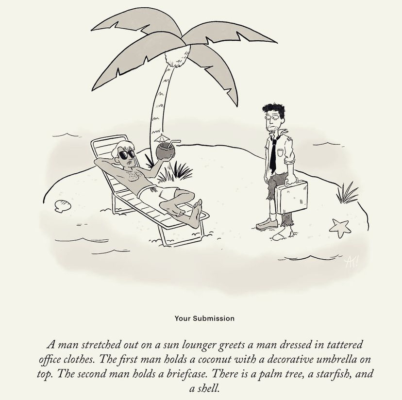

# A2Z_final
research of illustrations systems as language  

For my final project, I wanted to take what I learned from this class and combine it with my work outside of it. 
I work as an illustrator, and I enjoyed exploring rita and the way it made me think about language. The way computer analyze text is by classification- nouns, verbs, etc. I was wondering how I can create computational illustrations that behave in the way rita constract sentences.
Illustration, however, is all about the subtext. right?

