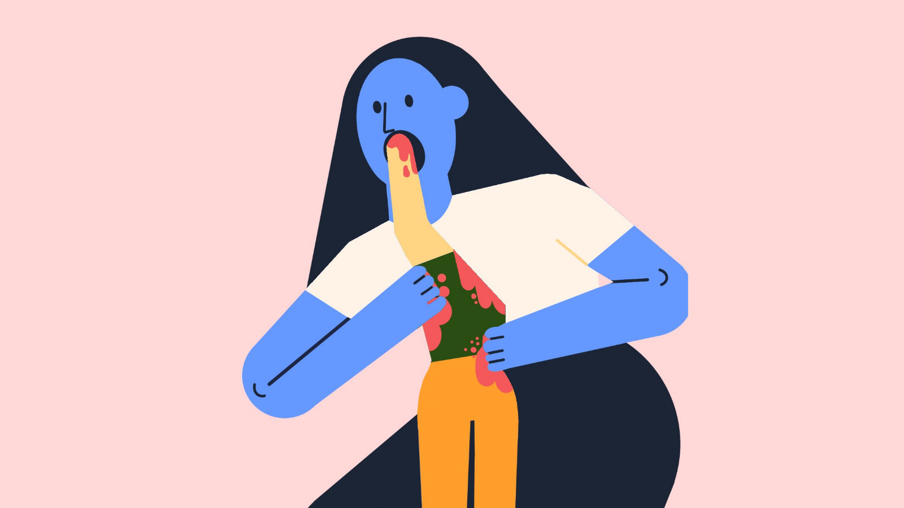

# A2Z_final
Research of illustrations systems  

For my final project, I wanted to take what I learned from this class and combine it with my work outside of it. 

I work as an illustrator, and I enjoyed exploring rita and the way it made me think about language. The way computer analyze text is by classification- nouns, verbs, etc. I was wondering how I can create computational illustrations that behave in the way rita constract sentences.

Illustration, however, is all about the subtext. right?

**Corporate Memphis**

Another point of interst for me is what is called "Corporate Memphis". In 2017 Facebook released an illustration system called "Allegria" that had is constracted from rules and parts, and the rest of the tech industry followed suit. The style work for cheap illustrations as well, since you can build it very easly by combining and merging differnt stock illustrations. According to wikipedia "The style has since been criticized for being generic,[5] overused, and attempting to sanitize public perception by presenting human interaction in utopian optimism.[1] Illustrators working in this style refer to it as flat art.[3] It is also known as the Alegria style,[1] Big Tech art style[6], Corporate art style, and Humans of Flat[1]."

For example, what the hell are the people in this illustration are doing?

From my work experience in tech- I know excactly how this kind of things happen, and I had my part in creating them. They are (or are they?) inclusive, fast to create, and good for making scary terms like "big data" seem cute. But this is how I feel about it this days:

Latley this idea has been taking in to even more extreme, as microsoft realsed to office word a system in which the user can create illustrations using smaller and smaller component. The user, in my view, is expected to behave like an algorithm.

